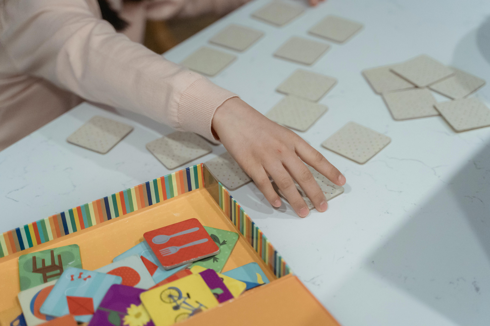

# Project | A B C Memory Game

 

# A B C Memory Game

Welcome to the A B C Memory Game!

Hey there, future web developers! 👋 Welcome to my A B C Memory Game project. I'm Mohamed Abdel Nasser, a web development student, and I created this game to make learning the alphabet a fun and engaging experience for children.

## What is the A B C Memory Game?

The A B C Memory Game is a web-based project that transforms alphabet memorization into an exciting and interactive experience. Through colorful visuals and engaging gameplay, young learners can reinforce their understanding of alphabet shapes while having fun.

## How to Play?

1. **Choose Your Level:** Select the difficulty level from the dropdown menu – easy, medium, or hard.
2. **Start the Game:** Click on the cards to reveal alphabet symbols. Your goal is to match pairs and enhance your memory skills.
3. **Keep an Eye on the Timer:** Challenge yourself by completing the game in the shortest time possible.
4. **Celebrate Victories:** When you successfully match all pairs, the win screen will appear. Congratulations on your achievement!

## Learning Goals

By working on this project, I achieved the following learning goals:

- **HTML & CSS Mastery:** Skillfully select and modify HTML elements using JavaScript DOM methods and properties.
- **Dynamic Interaction:** Add and remove HTML elements to/from the DOM dynamically, responding to user actions with event listeners.
- **Iterative Actions:** Iterate over lists of HTML elements, performing actions on each element – a crucial skill in web development.
- **Object-Oriented Programming:** Utilize classes and OOP principles to organize data, functionality, and game elements efficiently.
- **2D Game Development:** Create a simple yet engaging 2D game using HTML, CSS, JavaScript, and the DOM.

## How to Contribute?

If you're inspired by this project and want to contribute, follow these steps:

1. **Fork this Repository.**
2. **Clone your Fork.**
3. **Create a New Branch.**
4. **Make Your Changes and Commit.**
5. **Push Changes to Your Fork.**
6. **Create a Pull Request.**

Let's collaborate and make the A B C Memory Game even more fantastic together!

## Acknowledgments

Special thanks to all the little learners who inspired and tested the A B C Memory Game. Let's continue this journey of discovery and fun!

Feel free to explore, play, and learn with the A B C Memory Game. Happy coding! 🚀